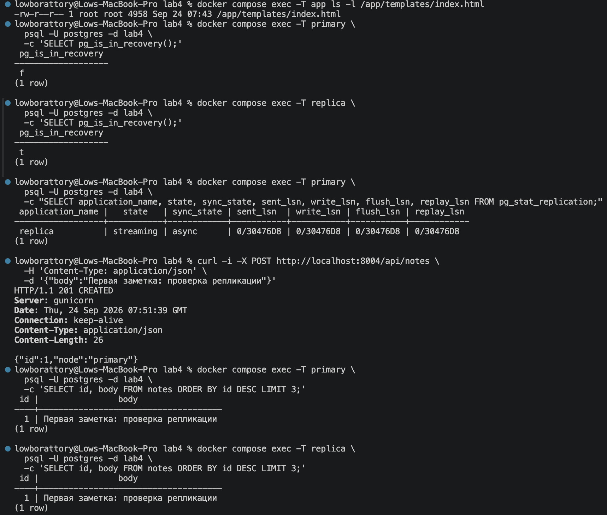
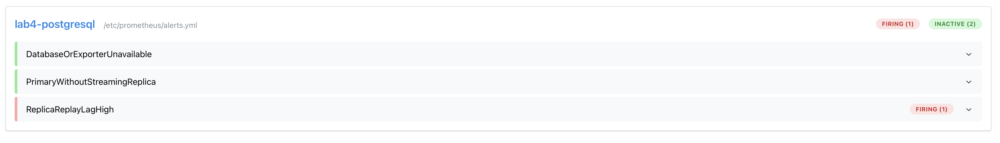
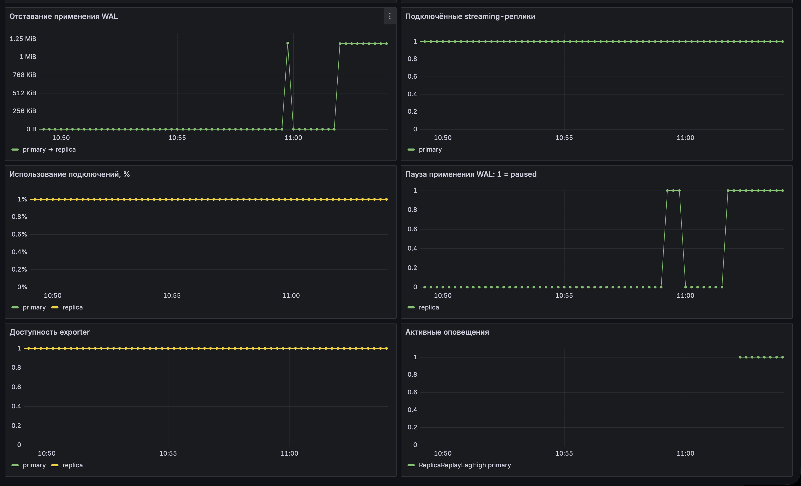
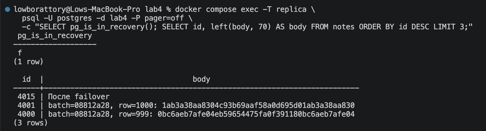
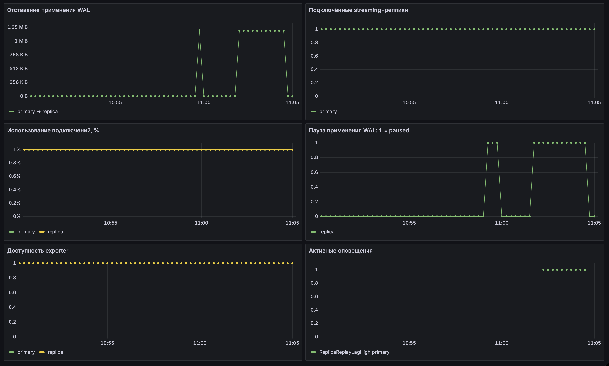

# Часть 0. Выбор базы данных

Для этой работы мы выбрали PostgreSQL. Нужно было поднять основной узел и реплику, настроить передачу данных, а потом проверить, что будет при задержке и отключении основного узла.

Для опытов подготовили сервис заметок. В нём можно создать запись, открыть список или закинуть сразу 1000 заметок. Всё собрали в Docker Compose, чтобы запускать стенд целиком и не возиться с каждым контейнером отдельно.

# Часть 1. Настройка репликации

Сначала подняли два узла. Основной назвали primary, второй — replica. Каждому выделили своё хранилище и настроили передачу изменений через журнал базы.

В настройках включили репликацию и разрешили читать данные со второго узла. Также создали пользователей для приложения, передачи изменений и мониторинга, каждому выдали нужные права.

Первую копию базы получаем через pg_basebackup. Подготовленный скрипт копирует данные основного узла, после чего реплика подключается к нему и получает дальнейшие изменения. При повторном запуске всё с нуля копировать уже не нужно.

Когда контейнеры запустились, проверили роли. На основном узле получили f, на реплике — t. Это результат проверки режима восстановления, для нашей схемы всё сошлось.

Потом посмотрели соединение. Увидели streaming и async, значит передача изменений идёт и репликация работает в асинхронном режиме. Пока всё окей 👍

Дальше создали первую заметку, получили HTTP 201 и проверили таблицу на обоих узлах. Запись нашлась и на основном, и на реплике. Значит, данные до второго узла действительно доехали, можно двигаться дальше)

# Часть 2. Подключение сервиса

Сервис подготовили на Python с Flask. На странице сделали поле для заметки, создание записи, обновление списка и массовую загрузку. Рядом показываем количество строк и максимальный идентификатор, чтобы проще следить за результатом.

Запись направили в основной узел, чтение — в реплику. Адреса вынесли в настройки, позже это пригодилось при переключении приложения.

На запуске немного провафлились. Сначала сборка упала, потому что содержимое Dockerfile приложения не добавили. Написали, сохранили, запустили снова — опять мимо, теперь страница выдала внутреннюю ошибку.

Пошли дебажить по логам, там выяснилось, что приложение не находит index.html. Проверили расположение файла, поправили и пересобрали контейнер. После этого страница наконец открылась, этот квест закрыли)

Заодно разобрались, почему обычный рестарт не помогал. Файлы приложения копируются в образ при сборке, поэтому новый шаблон нужно было добавить через пересборку.

Дальше потыкали кнопки. При создании заметки сверху появляется ответ основного узла, а список ниже загружается с реплики. При массовой загрузке записи сохраняются по отдельности, поэтому можно наблюдать, как второй узел их подхватывает.

В списке оставили последние 100 заметок, общее количество выводится рядом. После нескольких загрузок это спасает страницу от превращения в чёрти что из тысяч строк.

# Часть 3. Проверка задержки репликации

Сначала нажали загрузку 1000 записей и пошли смотреть графики. Ждали какой-нибудь движ, а там почти ничего не менялось.

Реплика могла успевать догонять основной узел между измерениями. Метрики у нас собираются раз в пять секунд, поэтому короткую задержку легко пропустить.

Тогда поставили применение изменений на реплике на паузу и снова закинули нагрузку. Соединение продолжало работать, новые изменения поступали на второй узел и ждали применения.

Вот тут отставание уже стало видно. На графике оно выросло примерно до 1,2 МиБ, при этом реплика оставалась подключённой. То есть узел на связи, но данные ещё не обновил.

Отставание мы смотрели по разнице позиций журнала. Получается значение в байтах, оно показывает объём изменений, который реплика ещё не применила. Сколько это займёт секунд, по одному этому числу сказать нельзя.

Потом сняли паузу и подождали. Реплика разобрала накопившиеся изменения, график вернулся к нулю. Наконец-то получили тот самый пик, ради которого весь этот движ и затевали)

Для пользователя такая задержка выглядит как будто приложение тупит. Заметку создал, успешный ответ получил, а в списке её пока нет. Можно подумать, что кнопка не сработала, нажать ещё раз и случайно сделать дубликат.

Поэтому при чтении с реплики нам важно следить за свежестью данных. Одного работающего соединения между узлами для этого мало.

# Часть 4. Связь с теоремой CAP

У нас основной узел может подтвердить запись раньше, чем реплика применит её у себя. Поэтому некоторое время на втором узле будут старые данные.

Если связь между узлами пропадёт, основной сможет продолжать принимать записи. Реплика тоже сможет отвечать доступному ей приложению, используя то, что уже успела получить. Получается, для такого чтения мы допускаем устаревший ответ ради доступности.

В нашем опыте сеть не отключалась. Мы ставили на паузу применение изменений, поэтому проверили именно отставание. Ситуацию с разрывом связи разобрали отдельно, к ней и относится CAP.

При этом запись в нашем стенде завязана на единственный основной узел. Если он выключен, новые заметки не сохраняются до переключения.

Для более свежих данных можно читать прямо с основного узла. Ему тогда достанется дополнительная нагрузка. Ещё можно настроить синхронную репликацию с ожиданием применения записи на выбранной реплике.

Во втором случае основной узел будет ждать её подтверждения. Если реплика замедлится или станет недоступна, запись тоже может зависнуть в ожидании. В общем, приходится выбирать, насколько свежие данные нам нужны и сколько мы готовы ждать.

# Часть 5. Отказ основного узла

После проверки задержки выключили основной узел и попробовали создать заметку.

Получили HTTP 503. Список при этом продолжал обновляться с реплики, на странице оставались 4001 запись и роль standby. Новые данные записать пока не можем, старые заметки всё ещё читаются.

Дальше вручную повысили реплику до основного узла. Контейнер всё ещё называется replica, хотя его роль уже поменялась. Здесь легко словить путаницу, поэтому проверяем состояние самой базы.

Затем поменяли адрес записи в настройках приложения, теперь оба вида запросов идут в бывшую реплику. Пересоздали только приложение, старый primary оставили выключенным.

Попробовали добавить заметку После failover. Она появилась в таблице с идентификатором 4015, ниже видны записи 4001 и 4000 от предыдущей нагрузки. Запись снова работает, хайп 👍

Пропуск между идентификаторами сам по себе не означает, что мы потеряли строки. Номера могут идти с пропусками, поэтому сохранность проверяем по данным.

После переключения у нас остался один работающий основной узел. Приложение ожило, но отдельной реплики больше нет. Для следующего отказа запасной узел нужно подготовить заново.

Просто включить старый primary было бы опасно. Он может начать принимать записи независимо от нового основного, данные разойдутся, и потом придётся разгребать две разные версии базы.

Поэтому старый узел нужно изолировать от записи и вернуть уже в роли реплики. Для этого можно сделать новую копию данных или использовать pg_rewind, если подходят условия.

В проде такие переключения автоматизируют, например через Patroni. При этом нужно следить, чтобы основной узел был один, а приложение подключалось именно к нему.

# Часть 6. Мониторинг

Для метрик запустили два отдельных сборщика, по одному на каждый узел. Они проверяют базу и отдают показатели Prometheus, а Grafana строит по ним графики.

Сначала убедились, что метрики вообще поступают. Иначе можно долго залипать в пустой график и искать проблему с нагрузкой, хотя сам мониторинг ещё не настроен)

На дашборд вывели доступность базы, роли узлов, отставание и количество подключённых реплик. Ещё добавили использование соединений, состояние паузы и активные оповещения.

Сборщик и базу проверяем отдельно. Сборщик может отвечать, даже когда до базы уже не достучаться, поэтому одного зелёного статуса нам недостаточно.

После настройки на графиках стало видно, когда появилась пауза, насколько выросло отставание и когда реплика снова догнала основной узел.

Для оповещений выбрали три ситуации. Первая — база или сборщик недоступны 15 секунд. Так мы замечаем отказ или потерю метрик.

Вторая — у основного узла 15 секунд нет подключённой реплики. Приложение ещё может работать, но резервной копии, которая получает новые изменения, уже нет.

Третья — отставание больше 256 КиБ держится 15 секунд. Это повод проверить реплику, потому что приложение может читать с неё устаревшие данные.

Пороги подобрали для нашей лабораторной. В проде их нужно подстраивать под нагрузку и допустимую задержку.

Чтобы проверить срабатывание, ещё раз поставили применение изменений на паузу, загрузили данные и подождали. Правило ReplicaReplayLagHigh перешло в Firing, остальные два остались неактивными.

В этот раз всё сошлось. Узлы доступны, соединение есть, а отставание уже достаточно большое и держится достаточно долго. До этого мы просто слишком рано бежали обновлять график)

Уведомления в почту или мессенджер не подключали. Здесь проверили сами правила и убедились, что оповещение о задержке действительно срабатывает.

# Итоги

Мы подняли основной узел и реплику, разделили чтение и запись, проверили передачу данных. Потом специально создали отставание, поймали его на графике и дождались оповещения.

Дальше выключили primary, повысили реплику и переключили приложение. Новая заметка сохранилась, запись снова заработала.

После этого ещё нужно восстановить второй узел как реплику. Иначе получится классическое «вроде починили», а к следующему отказу мы снова не готовы)
